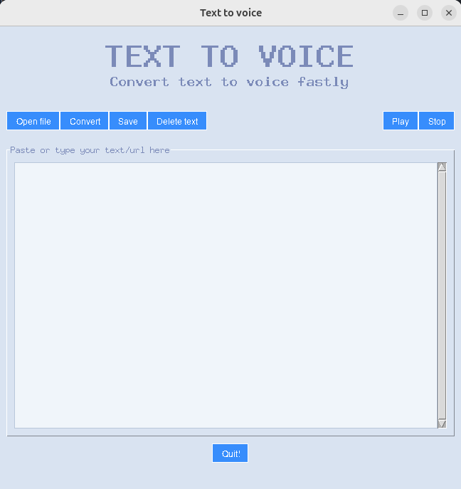

# 🇬🇧 - Text to Voice 🎙️

A desktop application created with **Python** and **Tkinter** that converts text to audio. You can input text directly, load it from a text file, or provide it through a URL. Compatible with **Mac**, **Linux**, and **Windows**.




## 🚀 Why is this project useful?

This project is ideal for those who need to quickly and easily convert written text to speech. Some reasons why it might be useful include:

- **Accessibility**: It allows people with visual impairments or reading difficulties to listen to written content.
- **Productivity**: It converts articles, books, or any other written content into audio format so you can listen to it while doing other tasks.
- **Includes compiled app**: In the *dist* folder, you will find the executable file of the application. It is developed to be compatible with **Mac**, **Linux**, and **Windows**.

---

## 🛠️ Requirements

Make sure you have the following requirements to run the application:

- **Python 3.x** installed. You can get it [here](https://www.python.org/downloads/).
- **Tkinter** (for the graphical interface). It is usually included with Python, but if you don't have it, you can install it with:
  ```bash
  sudo apt-get install python3-tk  # For Linux
  brew install python-tk  # For Mac
## 💻 How to start

- First, clone the repository.
    ```bash
  git clone https://github.com/damixtech/text_to_voice_app.git
- Then, install the dependencies.
  ```bash
  pip install -r requeriments.txt    
## 🔧 How to use
- Running the code:
    - Run the code from your code editor (e.g., VSCode).
  
- Running the executable file (Dist folder)
    - Run the application from the executable file in the "dist" folder. It is compatible with operating systems such as **Linux**, **Mac**, and **Windows**.

## 🤝 Contributing
This repository is completely open to contributions and improvements.

1. Fork the repository.
2. Create a new branch for your contribution.
3. Make your changes and commit them.
4. Push your changes to GitHub.
5. Open a pull request on GitHub.
   
### I will be happy to see your contributions.
---
# 🇪🇸 - Text to Voice 🎙️

Una aplicación de escritorio creada con **Python** y **Tkinter** que convierte texto a audio. Puedes ingresar texto directamente, cargarlo desde un archivo de texto o proporcionarlo a través de una URL. Compatible con **Mac**, **Linux** y **Windows**.


## 🚀 ¿Por qué es útil este proyecto?

Este proyecto es ideal para aquellos que necesitan convertir texto escrito en voz de manera sencilla y rápida. Algunas de las razones por las que podría ser útil incluyen:

- **Accesibilidad**: Permite a las personas con discapacidades visuales o dificultades de lectura escuchar contenido escrito.
- **Productividad**: Convierte artículos, libros o cualquier otro contenido escrito en formato de audio para escucharlo mientras haces otras tareas.
- **Incluye app compilada**: En la carpeta *dist* encontrarás el archivo ejecutable de la applicación, está desarrollada de forma que sea compatible en **Mac**, **Linux** y **Windows**.

---

## 🛠️ Requisitos

Asegúrate de tener los siguientes requisitos para ejecutar la aplicación:

- **Python 3.x** instalado. Puedes obtenerlo [aquí](https://www.python.org/downloads/).
- **Tkinter** (para la interfaz gráfica). Generalmente se incluye con Python, pero si no lo tienes, puedes instalarlo con:
  ```bash
  sudo apt-get install python3-tk  # Para Linux
  brew install python-tk  # Para Mac

## 💻 Cómo empezar

- Lo primero que tendrás que hacer es clonar el repositorio.
    ```bash
  git clone https://github.com/damixtech/text_to_voice_app.git
- Después instala las dependencias.
  
    ```bash
  pip install -r requeriments.txt    
## 🔧 Cómo usar
- Ejecutando el código:
    - Ejecuta el código desde tu editor de código (Por ejemplo VSCode)
  
- Ejecutando el archivo ejecutable (Carpeta Dist)
    - Ejecuta la aplicación desde el archivo ejecutable de la carpeta **"dist"**. Es compatible con sistemas operativos como **Linux**, **Mac** y **Windows**.

## 🤝 Abierto a contribuciones
Repositorio totalmente abierto a contribuciones y mejoras.
1. Haz un **fork** del repositorio
2. Crea una **rama nueva** para tu contribución
3. Realiza los cambios y hac el **commit**
4. Sube tus cambios a **GitHub**
5. Abre una **pull request** en GitHub
   
#### ❤️ Estaré encantado de ver tus aportaciones.